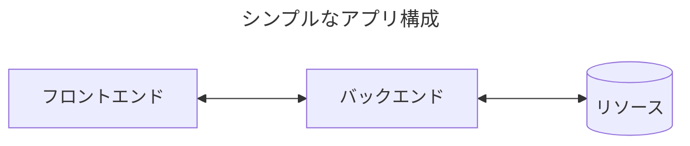
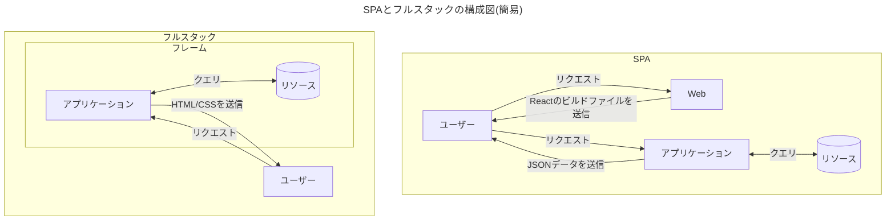
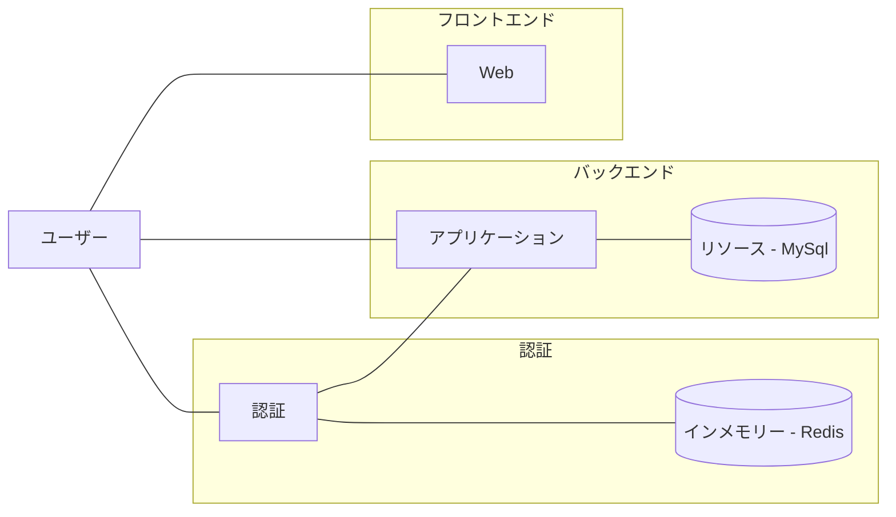

# React.jsと任意のリソースを取得するためのバックエンド構築のハンズオン

## 0. 概要

今回のハンズオンでは、フロントエンドとバックエンドの繋ぎ込みに焦点あてたハンズオンです。

特にバック側の実装について話す予定なので、フロントを触らず、主にバックエンド側の実装を進める予定です。

## 1. そもそもの話

Reactでアプリを作成する場合は、大抵画面に表示するためのリソースを提供するバックエンドがあります。

バックエンドは、テキストファイルやデータベースなどの永続的な情報を保持するものや、インメモリーのようなの短期的な情報を保持するものなど、様々なリソースを元に情報を加工し、フロントエンドに渡します。



React や Vue などのSPAと呼ばれるWebアプリケーションではページ生成をクライアント側で行います。

ページ生成時に足りないなデータは、その都度バックエンド側にリクエストを行い、データの取得を行います。

逆に Ruby on Rails、Django、Laravel、で作成する、いわゆるフルスタックなWebアプリケーションではページ生成をバックエンド側で行うため、クライアント側では既に完成されたページを画面に描画します。



SPAの構成でも、バックエンド側をフルスタックフレームワークで構成することもできます。

## 2. 実行環境

今回のハンズオンは以下の構成です。



| 構成           | 内容               |
| -------------- | ------------------ |
| フロントエンド | React.js           |
| バックエンド   | express<br />MySQL |
| 認証           | express<br />Redis |

### 2-1. ディレクトリ構成

```
.
├───auth
├───client
└───server
```

- auth/

  JWTによる認証が実装されているサーバーで、URLによるWebAPIで操作を行う。

- client/

  Reactで作成された簡単Webアプリ、ユーザーによる投稿・コメント・フォロー/フォロワー機能がある。

- server/

  これから実装ディレクトリ
  
  このディレクトリに含まれている app.js をこれから編集していきます。

### 2-2. セットアップ

Docker コンテナの起動とモジュールのインストールを行います。

```
docker-compose -d
npm install
npm run dev
```

サーバーの起動にはリソースとのアクセスが必要になるので、コンテナが起動してから開発用のサーバーを起動します。

## 3. バックエンドのHello World

### 3-1. 動的なHTML

まずは、フルスタック なアプリケーションの様にHTMLを返却するルートを作成してみます。

```javascript
const app = express()
const port = 8000

app.get('/', (res, req) => {
  req.setHeader('Content-Type', 'text/html')
  req.send(`<html lang="ja">
<head>
  <title>Hello World!</title>
</head>
<body>
  <h1>Hello World</h1>
  <h2>Express App</h2>
</body>
</html>`)
})

app.listen(port, (err) => {
  if (err) console.log(err)
  console.log(`Example app listening on port ${port}`)
})
```

http://localhost:8000 にブラウザでアクセスすると Hello World が表示されます。

また、curlなどのコマンドでアクセスすることで、HTMLのテキストが表示されます。

画面に表示されているHTML情報は、動的に生成されているものなのでJavaScriptのコードを簡単に埋め込めます。

```javascript
const app = express()
const port = 8000

app.get('/', (res, req) => {
  req.setHeader('Content-Type', 'text/html')
  req.send(`<html lang="ja">
<head>
  <title>Hello World!</title>
</head>
<body>
  <h1>Hello World!!!</h1>
  <h2>Express App</h2>
  <p>3 + 4 = ${3 * 4}</p>
</body>
</html>`)
})

app.listen(port, (err) => {
  if (err) console.log(err)
  console.log(`Example app listening on port ${port}`)
})

```

### 3-2. JSONのレスポンス

HTMLのレスポンスができることを確認したら、次はJSON形式のレスポンスを行います。

JSON形式も書き方ほとんど同じです。

```JavaScript
<-- 省略 -->

app.get('/json', (res, req) => {
  req.setHeader('Content-Type', 'Application/json')
  req.send(`{"message": "hello"}`)
})

app.listen(port, (err) => {
  if (err) console.log(err)
  console.log(`Example app listening on port ${port}`)
})

```

http://localhost:8000/json にブラウザでアクセスすると JSON形式 の内容が表示されます。

Express では、JSON形式のテキストを返す際に、sendメソッドの変わりにjsonメソッドを使用することができます。

jsonメソッドを使用することでヘッダーにコンテンツタイプの設定をする手間が省けます。

```javascript
<-- 省略 -->

app.get('/json2', (res, req) => {
  req.json({message: "hello"})
})

app.listen(port, (err) => {
  if (err) console.log(err)
  console.log(`Example app listening on port ${port}`)
})
```

基本的に、クライアント側とバックエンド側の通信はJSON形式でデータのやり取りを行うので、何かしらのデータを返却する時はjsonメソッドを使用します。

## 4 データベースとのHello World

ユーザーが入力した情報やECの商品情報など、Webアプリケーションでは永続して所持する必要があるデータがあります。

そのデータを保持しておくための１つ手段として、データベースがあります。

ファイルの先頭にデータベースへの接続に必要なモジュールのインポートと、データベースに接続を行います。

```javascript
import express from 'express'
import fetch from 'node-fetch'
import mysql from 'mysql2/promise'

const connection = await mysql.createConnection({
  host: 'localhost',
  user: 'user',
  password: 'password',
  database: 'example'
})

<-- 省略 -->
```

MySQLへのクエリは、```connection```から行います。

データベースとの疎通がしっかりを行えているか、定数を返却するクエリを実行します。

```javascript
<-- 省略 -->

app.get('/db', async (res, req) => {
  const [result, meta] = await connection.query('SELECT 42')
  req.json(result)
})

app.listen(port, (err) => {
  if (err) console.log(err)
  console.log(`Example app listening on port ${port}`)
})

```

http://localhost:8000/db にブラウザでアクセスするとクエリ結果の内容が表示されます。

ブラウザの画面に```42```が表示されていれば、正常にデータベースとの接続が行えています。

## 5. クライアントから通信を行う

### 5-1. デベロッパーツールから通信を確認

Reactのアプリケーションからバックエンドに通信を行う際は、ちょっとした設定が必要になります。

http://localhost:3000/test/api にアクセスし、バックエンドからレスポンスを確認します。

レスポンスの確認は、ブラウザのデベロッパーツールから確認を行います。

以下は、上記のURLに対応する、Reactのコンポーネントのソースコードです。

```javascript
import { useState, useEffect } from 'react'
import apiClient from '../../lib/apiClient'

export default function Api () {
  const [data, setData] = useState({})

  useEffect(() => {
    (async () => {
      const res = await apiClient.get('/client')
      setData(res)
    })()
  }, [])

  return (
    <div>
      <p>http://localhost:8000/client</p>
      <p>
        response: <br/>
        {JSON.stringify(data)}
      </p>
    </div>
  )
}
```

このページでは、http://localhost:8000/client に通信を行い、そのレスポンスデータ文字列に変換し画面に描画しているコンポーネントになります。

コード内登場している```apiClient```は、fetchの記述を簡略化しているものなので、通常のfetchと内部の処理は同じです。

まず、通信先まだ定義されていない状態なので、404 Not Found がレスポンスとして返却されてしまいます。

以下のコード追記し、通信先を定義します。

```javascript
<-- 省略 -->

app.get('/client', (res, req) => {
  req.json({message: "hello"})
})

app.listen(port, (err) => {
  if (err) console.log(err)
  console.log(`Example app listening on port ${port}`)
})

```

通信先を定義したら、もう一度 http://localhost:3000/test/api にアクセスし、デベロッパーツールから通信の結果を確認します。

次は、CORS エラーと表示されました。

### 5-2. CORSとは

Cross-Origin Resource Sharing の略称で、クロスオリジン間でのリソースのやり取りに対して制約のことです。約の内容によって、特定のオリジンからの通信を拒否したり、全オリジンからの通信を許可したりすることができます。

オリジンは、URLに含まれている、プロトコルとホスト名とポート番号によって決まります。


この3つの要素がどれか1つでも違えば、別のオリジンという扱いになります。ほとんどの場合、ポート番号が省略されていますが、プロトコルの一般的のポート番号を使用している限りは、明記しているしていない関係なく同一のオリジンとして扱われます。

| リクエスト元          | リクエスト先           | 関係           |
| --------------------- | ---------------------- | -------------- |
| http://localhost      | http://localhost       | 同一オリジン   |
| http://localhost:80   | http://localhost       | 同一オリジン   |
| https://localhost     | http://localhost       | クロスオリジン |
| https://localhost     | https://localhost:443  | 同一オリジン   |
| http://localhost:3000 | http://localhost:3000  | 同一オリジン   |
| http://localhost:3000 | https://localhost:3000 | クロスオリジン |
| http://localhost:3000 | http://localhost:8000  | クロスオリジン |

通信がクロスオリジンで行われる場合、ほとんどの場合CORSの設定が必要になります。

このCORSの設定は、バックエンドでは設定行います。

```javascript
import express from 'express'
import fetch from 'node-fetch'
import mysql from 'mysql2/promise'
import cors from 'cors'

const connection = await mysql.createConnection({
  host: 'localhost',
  user: 'user',
  password: 'password',
  database: 'example'
})

const app = express()
const port = 8000

app.use(cors())

<-- 省略 -->
```

今回使用しているExpressでは、corsモジュールをインポートし、routeのミドルウェアに設定を行うことでCORSの設定を行うことができます。

corsモジュールのデフォルト設定は、全通信の許可なのでどこからでも通信を受けている状態になっています。

設定後もう一度、Reactのアプリケーションを覗いている見ると、レスポンス結果が表示されていると思います。

## ユーザー認証

まだ


