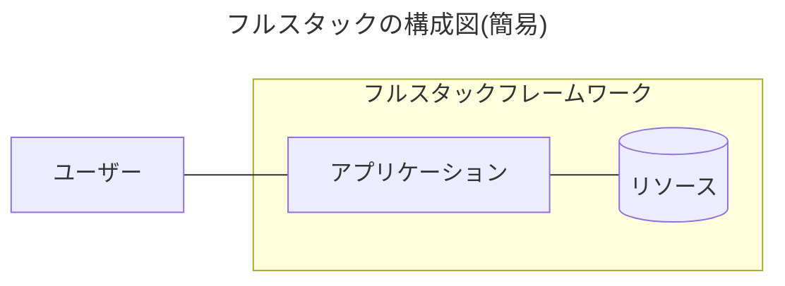
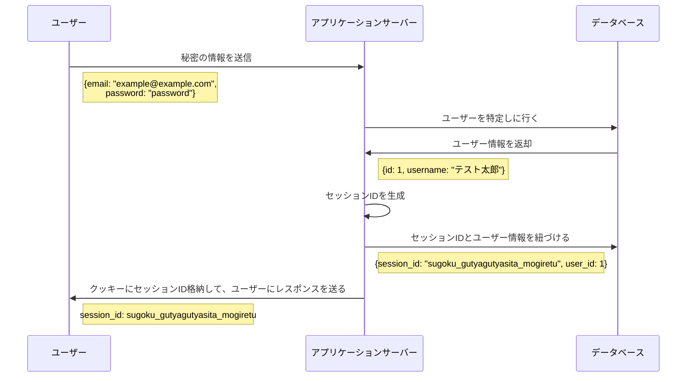
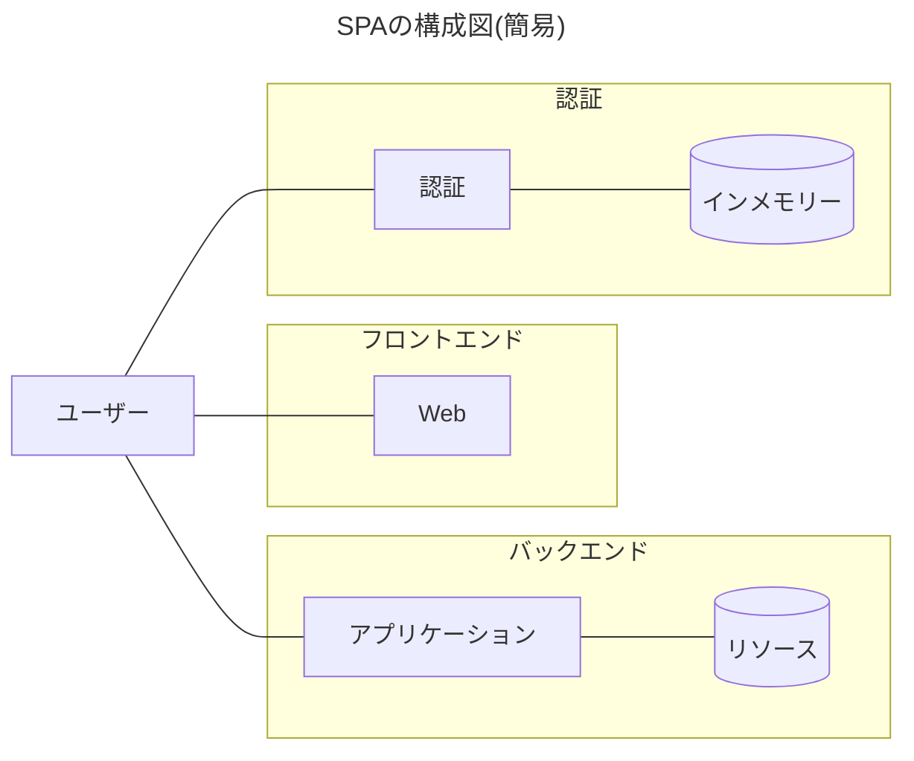
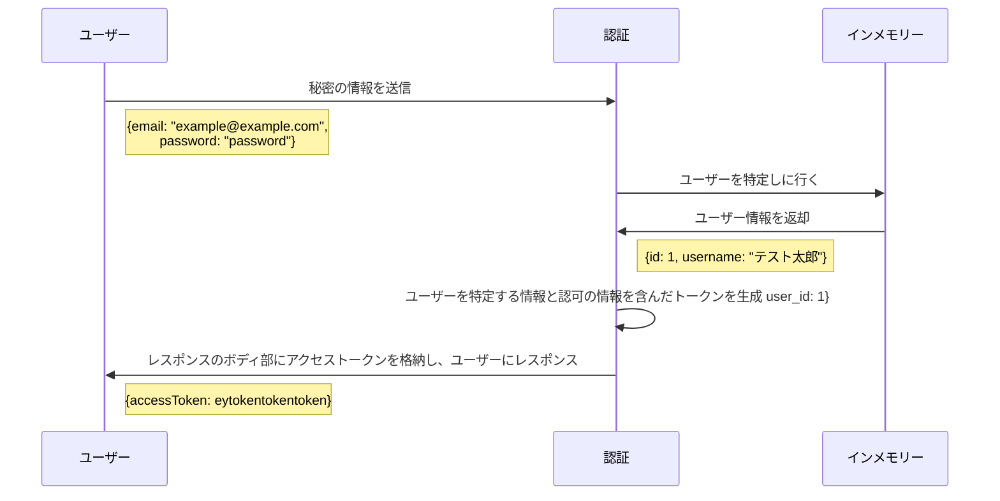
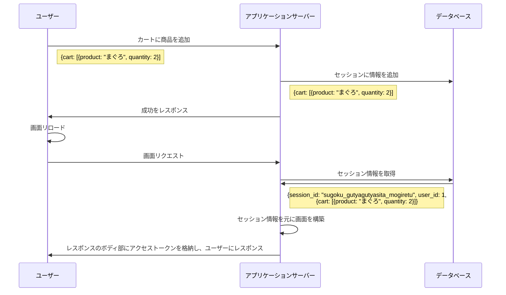

# Webアプリケーションのステートレスだったりステートフルだったりなユーザー認証

## そもそもの話

### そもそもユーザー認証って？

Webアプリケーションを利用するユーザーに対して行うもんもので、パスワード認証や生体認証など、秘密の情報を用いてユーザーを特定するものです。

認証情報にはアプリケーション内で使用される、ユーザーテーブルのプライマリーキーなどが紐づきます。

そのためユーザー認証を終えた状態で、サービスを利用する時に再度認証を行うなうことも、行動とユーザーが紐づいた状態でアプリケーション内で処理されます(ex. 購入だったり、履歴だったり)。

### 認証と認可は違う

良くある勘違いとして、認証と認可がごっちゃになっていることがあります。

認証は先ほど説明した通り、Webアプリケーションを利用する特定のユーザーのことです。

認可は、その特定のユーザーがアクセス可能なリソースかどうかを決定するものです。

例えば、ページへのアクセス権限であったり、特定のコンテンツへの利用を制限するなどは認可と言えます。

## じゃあ認証を行うには？

### フルスタックフレームワークの場合

フルスタックフレームワークで作成されるデフォルトの構成図は以下の様なものが大半になります。

ユーザーはアプリケーションサーバーに秘密の情報を送り、アプリケーション側ではその情報を元にユーザーを特定します。

ユーザーの特定が完了すれば、**セッションID**を発行します。

**セッションID**自体はランダムでユニークな文字列であり、**セッションID**とユーザーを特定するための情報をセットでデータベースなり、テキストファイルなりに登録します。そうすることで、**セッションID**からユーザー情報を取得することができるようになります。

特定のユーザーを取得することができるようになった**セッションID**をクッキーにセットし、ユーザーにレスポンスを送信します。

クッキーはユーザーがアプリケーションサーバーにリクエストを行うたびに、自動的に送信されます。

つまり、アプリケーション側はどのユーザーからリクエストを行われたかを知るためには、クッキーに含まれるセッションIDを見ればいいというわけです。

### SPAの場合

よくあるSPAの構成図は以下の様なものになります。

認証サーバーに秘密の情報を送り、認証側でユーザーを特定します。

ユーザーの特定が完了すれば、**アクセストークン**を生成します。

**アクセストークン**にはユーザーを特定するための情報や、認可の用途に使用されるロールやパーミッション情報などが含まれる場合もあります。

ユーザーを特定する情報や認可の情報を含んだ、アクセストークンをレスポンスのボディ部にセットし、ユーザーにレスポンスします。

ユーザーに送信された**アクセストークン**はブラウザ上で保存され、**アクセストークン**の有効期限が切れるまで、同じものを使いまわします。

アクセストークンは、自動でバックエンド側や認証サーバーに送る機能はなく、HTTP通信を行う際に、ヘッダー部にアクセストークンをセットすることでバックエンド側でもユーザー情報を扱うことができます。

また上記の構成の場合、バックエンド側は認証サーバーに通信を行わず、暗号化時のシークレットキーを保持していれば、ユーザーから送られたトークンを検証することができるため、安全にトークンの情報を使用することができます。

## ステートフルでステートレス

フルスタックフレームワークが行う、セッションによるユーザー認証はステートフルで、SPAが行う、アクセストークンを使いまわす認証をステートレスと言います。

ステートは状態を意味する言葉で、セッションは状態を持つ認証であり、アクセストークンは状態を持たない認証ということになります。

### ステートフル

ステートフルとは、状態を持つことができる、言い換えれば状態を維持することができるという意味になります。

例えば、ECサイトには、当然のようにカート機能があると思います。カート機能がユーザーが購入したいと思った商品がどんどん使いされて行き、最終的にはカートの内容で決済を行います。

このカートの処理が全て１つの画面で済めば、フォームを値を見て決済まで進めることできるのですが、通常１つの画面で、購入までの決済が完了することはなく、いくつかの画面を挟むことになります。

ここで問題になるのが、フォームなどのユーザーが入力した情報は、画面を遷移時に引き継がないため、ユーザーが入力した情報が失われてしまうという点です。

ここで登場するのが、セッションです。

セッションは、ユーザー認証以外にもユーザーが行った処理を保存しておくという役割もあり、上の例でいうとカートに追加した商品がセッションに登録され、リロード時にアプリケーション側セッションの内容を確認し、カートの状態を復元します。

セッションがあることにより、同じURLに対してアクセスしてもセッションの状態によって、別の情報が表示されるようになります。

### ステートレス

ステートレスとは、状態を持たないので、状態を維持することはできません。

お気づきかもしれませんが、HTTP通信はステートレスになります。

ステートレスな通信なため状態を維持せず、画面リロードしたら、フォームがリセットされていたり、フォームの状態を遷移先に引き継ぎません。

アクセストークンは一度、生成されてからは破棄されるまでトークンが保持する値は変わりません。そのため、同じアクセストークンを使って、アプリケーション側に通信を行うと同じ値が帰ってきます。

## SPA で主に使用されている認証

SPAでは主にJWTを使用した、Bearer認証を使うことが多いです。

